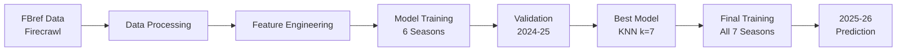

<div align="center">


# Saudi Pro League ML Predictor

### Machine Learning-Powered Season Standings Prediction

<br/>

<p align="center">
  <a href="https://skillicons.dev">
    
  </a>
</p>

<p align="center">
  
  
  
  
</p>

<br/>

**Predicting the 2025/26 Saudi Pro League final standings using advanced machine learning and multi-model validation**

[View Presentation](Saudi_League_ML_Presentation.pdf) • [Open Notebook](Saudi_League_ML_Predictor.ipynb) • [View Data](data/)

</div>

---

## Overview

This project employs **multiple machine learning models** to forecast the 2025/26 Saudi Pro League standings by analyzing 7 seasons of historical match data (2018-2025). After comprehensive model comparison and validation, **K-Nearest Neighbors (k=7)** was selected as the optimal predictor. Data was scraped from **FBref** using **Firecrawl**.

### Key Features

- **Multi-Model Comparison**: 8 different ML algorithms tested (KNN, Random Forest, SVM, Gradient Boosting, etc.)
- **Rigorous Validation**: Models validated on hidden 2024-25 season data
- **Best Model**: KNN (k=7) - MAE of 2.47 positions, 26.7% exact accuracy
- **Comprehensive Analysis**: Feature importance, prediction confidence, and error analysis

### 2025/26 Season Prediction

<div align="center">

| Pos | Team | Predicted Rank | Zone |
|:---:|:-----|:--------------:|:-----|
| **1** | **Al-Ittihad** | 1.86 | Champion |
| **2** | **Al-Hilal** | 2.47 | ACL Elite |
| **3** | **Al-Nassr** | 3.20 | ACL Elite |
| **4** | **Al-Ahli** | 4.33 | Safe |
| **5** | **Al-Qadisiyah** | 5.87 | Safe |

<sub>Top 3 qualify for AFC Champions League Elite | Bottom 3 face relegation</sub>

</div>

---

## Quick Start

```bash
# 1. Install dependencies
pip install -r requirements.txt

# 2. Launch Notebook
jupyter notebook Saudi_League_ML_Predictor.ipynb
```

---

## Model Performance & Validation

### 2024-25 Season Validation Results

The model was validated on the complete 2024-25 season (hidden during training):

| Metric | KNN (k=7) | Random Forest | KNN (k=5) |
|:-------|:---------:|:-------------:|:---------:|
| **Mean Absolute Error** | **2.47** | 2.47 | 2.60 |
| **Exact Predictions** | **26.7%** | 13.3% | 20.0% |
| **Within ±3 Positions** | **73.3%** | 73.3% | 73.3% |

**KNN (k=7) was selected as the best model** due to its superior accuracy and balanced performance across all metrics.

---

## Data & Methodology

### Data Source: Firecrawl + FBref
Historical match data was extracted from [FBref](https://fbref.com/) using **Firecrawl**, enabling precise collection of 7 seasons of match results:
- **7 Seasons** (2018/19 - 2024/25)
- **~1,800 Matches** processed
- **18 Teams** per season
- **Features**: Points, Wins, Draws, Losses, Goals For/Against, Goal Difference

### Machine Learning Approach

**Models Tested:**
1. K-Nearest Neighbors (k=3, k=5, k=7)
2. Random Forest (Optimized)
3. Support Vector Machine (RBF kernel)
4. Gradient Boosting
5. Decision Tree
6. Logistic Regression

**Training Strategy:**
- **Training Data**: 2018-19 through 2023-24 seasons (6 seasons)
- **Validation Data**: 2024-25 season (hidden during training)
- **Final Model**: Retrained on all 7 seasons for 2025-26 predictions
- **Feature Scaling**: StandardScaler for normalization

<details>
<summary><b>View Pipeline Architecture</b></summary>


</details>

---

## Key Insights

### 2025-26 Predictions
- **Al-Ittihad** is the predicted champion (Predicted Rank: 1.86)
- **Top 3 ACL Race**: Al-Ittihad, Al-Hilal, and Al-Nassr expected to secure Champions League spots
- **Relegation Battle**: Al-Raed, Al-Orobah, and Al-Khaleej face the highest risk

### Model Insights
- **Most Important Features**: Points per game, goal difference, and win rate
- **Validation Accuracy**: 73.3% of teams predicted within ±3 positions
- **Best Predictions**: 26.7% of teams predicted exactly correct for 2024-25

> **Note**: Predictions are based solely on historical performance statistics and do not account for mid-season transfers, injuries, or tactical changes.

---

## Notebook Features

The Jupyter notebook includes:

- **Multi-Model Training & Comparison**: 8 different ML algorithms tested
- **Top 3 Models Deep Dive**: Detailed analysis with visualizations
- **2024-25 Validation**: Complete performance analysis on hidden season
- **Prediction vs Actual Plots**: Scatter plots with error bands
- **Feature Importance Analysis**: Understanding key prediction drivers
- **Color-Coded Tables**: Visual representation of standings by zone
- **Executive Summary**: Side-by-side validation and prediction comparison

---

## Project Structure

```
Saudi_League_2025_ML_Predictor/
├── Saudi_League_ML_Predictor.ipynb      # Main Analysis Notebook
├── Saudi_League_ML_Presentation.pdf     # Project Presentation
├── data/                                # Historical Season Data (CSV)
│   ├── saudi_2018-19.csv
│   ├── saudi_2019-20.csv
│   ├── ...
│   └── saudi_2024-25.csv
├── assets/                              # Visual Assets
├── requirements.txt                     # Python Dependencies
└── README.md                            # This File
```

---

## Requirements

- Python 3.8+
- pandas
- scikit-learn
- matplotlib
- seaborn
- jupyter

See `requirements.txt` for complete list.

---

## License & Attribution

**Data Source**: [FBref](https://fbref.com/) via Firecrawl  
**Author**: Salman  

---

<div align="center">

Made with Python & Scikit-Learn | Saudi Pro League 2025-26 Season

</div>
